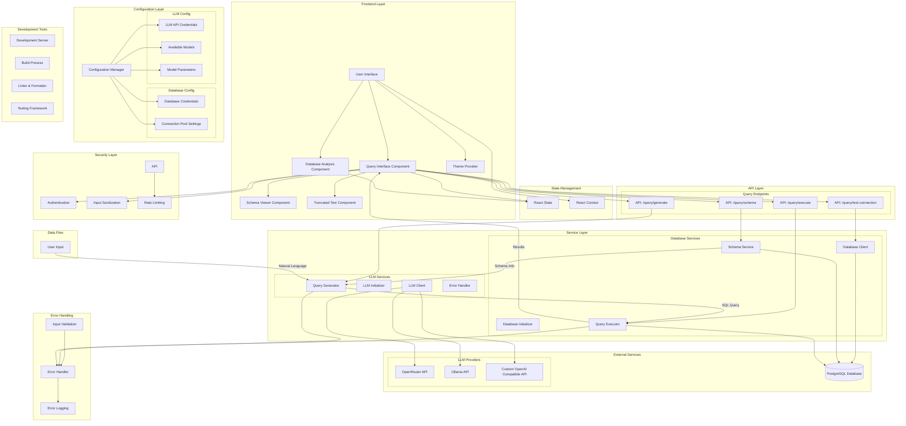
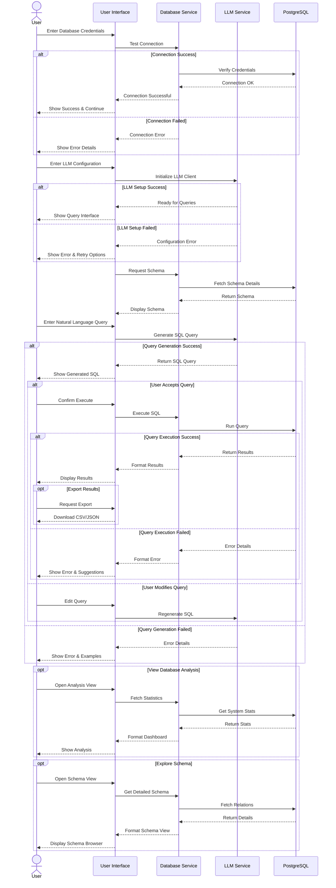
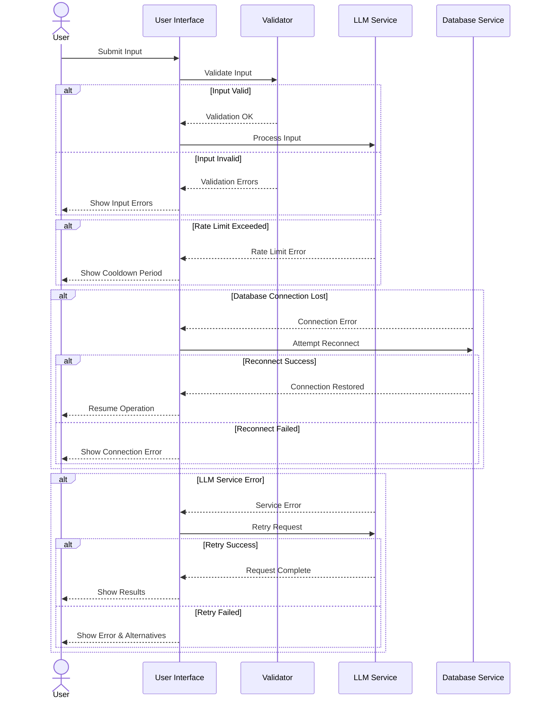

# Smart Postgres Application Architecture

## Application Flow Diagram

## Component Descriptions

### Frontend Layer
- **User Interface**: Main application container
- **Query Interface**: Handles natural language input and query results
- **Database Analysis**: Provides database metrics and analysis
- **Schema Viewer**: Displays database schema and relationships
- **Theme Provider**: Manages application theming

### API Layer
- **/api/query/generate**: Converts natural language to SQL
- **/api/query/execute**: Executes SQL queries
- **/api/query/schema**: Retrieves database schema
- **/api/query/test-connection**: Tests database connectivity

### Service Layer
- **Database Services**: Manages database connections and operations
- **LLM Services**: Handles AI model interactions and query generation
- **Schema Service**: Manages database schema information
- **Query Executor**: Handles query execution and result pagination

### External Services
- **PostgreSQL**: Target database system
- **LLM Providers**: 
  - OpenRouter (Claude, GPT-4)
  - Ollama (Local models)
  - Custom OpenAI-compatible endpoints

### Configuration Layer
- **Database Config**: Connection and pool settings
- **LLM Config**: API credentials and model parameters
- **Application Config**: General application settings

### Security Layer
- **Authentication**: User authentication
- **Input Sanitization**: Query and input validation
- **Rate Limiting**: API request limiting

### Development Tools
- **Development Server**: Next.js development environment
- **Build Process**: Production build pipeline
- **Testing**: Unit and integration tests
- **Linting**: Code quality tools

## Data Flow

1. User enters natural language query
2. Query is validated and sanitized
3. LLM service generates SQL query
4. SQL query is executed against database
5. Results are paginated and formatted
6. UI displays results to user

## Error Handling

1. Input validation errors
2. LLM generation errors
3. Database execution errors
4. Network and connection errors
5. Rate limiting errors

## User Workflow Diagrams

### Database Connection and Query Workflow

### Error Handling Workflow

